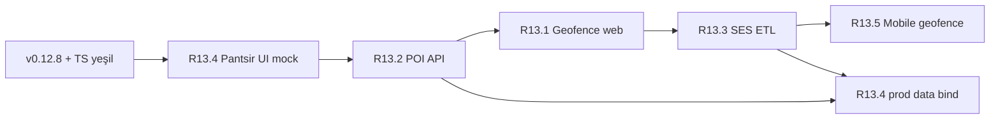

# R13 PANTSIR Sprint — Konum Bazlı Gayrimenkul İstihbarat

**Tarih:** 2026-05-30  
**Durum:** PLAN (implementasyon öncesi)  
**Referans envanter:** Cursor mahalle intel envanter (2026-05-29) — tip + mock var, gerçek API yok  
**Vizyon:** Kullanıcı bir bölgede gezerken **bildirim** alır; ilan yanında **yakın kurum/POI** + **suç / eğitim / sosyo-ekonomik** skorları **tek panelde** (Pantsir tarzı katmanlı savunma UI metaforu) görür.

**Toplam:** 5 paket · ~49 saat · ~1 hafta (1 geliştirici tam zamanlı)  
**Önerilen sıra:** Feature-Visible-First (Seçenek C — aşağıda)

---

## Mevcut Durum (Baseline — main)

| Alan | Durum | Dosya / not |
|------|--------|-------------|
| Suç / eğitim / SES tip | ✅ Var | `src/types/property/neighborhood.ts` |
| Demo seed | ✅ Var | `src/lib/demo-data/neighborhood/seedNeighborhoodData.ts` |
| AI rapor mock | ✅ Var | `src/lib/aiAnalysis.ts` → `socio_*`; `PropertyAnalysisReportViewer` “Sosyoekonomik” sekmesi |
| İlan yanı panel | ❌ Yok | `AuctionDetail.tsx` — skorlar AI Analiz sekmesinde gizli |
| Konum katman motoru | 🟡 Demo | `src/lib/location/locationIntelligenceEngine.ts` (SES, eğitim, güvenlik proxy) |
| Komşuluk modülü | ✅ Deprem only | `KomsulukRiskAnaliziPage` + `KomsulukRiskCharts` |
| DB socio kolonları | ✅ Şema | `property_analysis_reports.socio_*` (`20260501120000_ai_buynow_deposit.sql`) |
| Geofence / push | ❌ Yok | `matching-fanout` yalnızca şehir+fiyat eşleştirme |
| Gerçek TÜİK/MEB/EGM | ❌ Yok | Edge function entegrasyonu yok |
| Mobile geofence | ❌ Yok | `ihaleal-mobile` ayrı worktree; bg location yok |

**Hukuk / ürün sınırı:** Skorlar **bilgilendirme niteliğinde**; “resmi asayiş raporu” veya “MEB resmi sıralama” iddiası yok. Mock → gerçek geçişte kaynak etiketi + disclaimer zorunlu.

---

## R13.1 — Konum Bazlı Bildirim (Geofence) — ~10 saat

### Amaç
Kullanıcı haritada veya adres aramasıyla **bölge çizdiğinde**, o alana yeni ilan / fiyat düşüşü / eşleşme olduğunda **push + in-app** bildirim.

### Veri modeli (yeni migration)

```sql
-- user_geofences: kullanıcı tanımlı alan
-- id, user_id, label, center_lat, center_lng, radius_m OR polygon_geojson,
-- alert_types text[], is_active, created_at

-- location_alerts: fan-out kuyruk / teslimat log
-- id, geofence_id, listing_id, alert_type, payload jsonb, delivered_at, channel
```

**RLS:** `user_id = auth.uid()` SELECT/INSERT/UPDATE/DELETE on `user_geofences`; `location_alerts` SELECT owner via join.

### Edge / backend

| Bileşen | İş |
|---------|-----|
| `matching-fanout` genişlet | Listing insert/update sonrası PostGIS `ST_DWithin` veya bbox ile aktif geofence eşleştir |
| Yeni `geofence-notify` (opsiyonel) | Yoğun trafikte fan-out’u ayır; pgmq kuyruk (`20260516120400_v2_pgmq_matching.sql` pattern) |
| `notifications` tablo | Mevcut — `type: geofence_listing`, `channel: in_app \| push` |

### Push kanalları

| Kanal | Teknoloji | Not |
|-------|-----------|-----|
| Web | Web Push (VAPID) + service worker | `public/sw.js` veya Vite PWA plugin |
| iOS | APNs via Expo / FCM bridge | R13.5 ile birlikte |
| Android | FCM | R13.5 ile birlikte |

**Web-only MVP (R13.1):** VAPID + `push_subscriptions` tablo (`user_id`, `endpoint`, `keys`, `platform`).

### UI

- Yeni rota: `/ayarlar/bildirimler` (veya `Settings.tsx` alt sekmesi)
- Geofence CRUD: harita üzerinde daire çiz (Leaflet — repo’da zaten var)
- Toggle: yeni ilan / fiyat düşüşü / AI skor eşiği
- KVKK: konum verisi amaç sınırı + silme hakkı (`CURSOR_PAKET archive` geofence metni referans)

### Kabul kriterleri

- [ ] Aktif geofence + yeni listing → in-app bildirim ≤ 2 dk (cron dakikalık)
- [ ] Web push izni verilmiş kullanıcıya tarayıcı bildirimi
- [ ] RLS: başka kullanıcının geofence’i okunamaz
- [ ] `matching-fanout` mevcut buyer_preferences akışı **bozulmaz**

### Dosya hedefleri

- `supabase/migrations/YYYYMMDD_user_geofences.sql`
- `supabase/functions/matching-fanout/index.ts` (genişlet)
- `supabase/functions/push-dispatch/index.ts` (yeni, VAPID)
- `src/pages/settings/NotificationSettingsPage.tsx`
- `src/lib/geofence/` (client CRUD + harita)

### Risk

- PostGIS extension Supabase projede aktif mi — deploy öncesi doğrula
- iOS Safari Web Push kısıtları — native app (R13.5) yedek plan

---

## R13.2 — Yakın POI Haritası — ~8 saat

### Amaç
İlan koordinatına göre **yakın kurumlar** listesi + harita pinleri: sağlık, eğitim, devlet, ticaret, ulaşım, sosyal.

### API seçenekleri

| Seçenek | Artı | Eksi | Öneri |
|---------|------|------|-------|
| **Google Places Nearby** | Kalite, kategori zengin | Maliyet ($) | Prod hedef |
| **OSM Overpass** | Ücretsiz | Rate limit, TR veri boşlukları | Dev/staging + fallback |
| **Hybrid** | Maliyet kontrol | İki pipeline | **Önerilen** |

### Backend cache

```sql
-- poi_cache: geohash_6, category, payload jsonb, fetched_at, ttl
-- Edge: poi-nearby?lat=&lng=&categories=
```

- TTL: 7 gün (statik POI); okul/hastane için 30 gün
- Redis yok — Postgres cache yeterli (MVP)

### Frontend

- `src/components/property/NearbyPOIList.tsx` — kategori accordion, mesafe, yürüme süresi
- `src/components/property/NearbyPOIMap.tsx` — Leaflet mini harita (mevcut `AuctionDetail` iframe yanına)
- Kategoriler: `health | education | government | commerce | transit | social`

### Mevcut kod bağlantısı

- `AuctionDetail` “Konum” sekmesi: `nearbyFacilities` statik → **POI API ile değiştir**
- `locationIntelligenceEngine` POI mesafeleri → gerçek POI cache’den besle (R13.4 birleşim)

### Kabul kriterleri

- [ ] 500 m / 1 km / 3 km yarıçap filtre
- [ ] 6 kategori × min 3 sonuç (veri yoksa “veri yok” mesajı)
- [ ] API key istemci bundle’da **yok** (Edge proxy)
- [ ] Cache hit rate log (Edge)

### Dosya hedefleri

- `supabase/functions/poi-nearby/index.ts`
- `src/components/property/NearbyPOIList.tsx`
- `src/lib/poi/types.ts`, `src/lib/poi/fetchNearbyPoi.ts`

---

## R13.3 — Sosyo-Ekonomik Veri (TÜİK + MEB + EGM) — ~12 saat

### Amaç
Mahalle / ilçe bazında **gelir, eğitim, suç proxy** skorlarını gerçek veya lisanslı kaynaktan ETL ile doldur; mock bandını kaldır.

### Veri modeli

```sql
-- neighborhood_data
-- id, city, district, neighborhood_slug, source, as_of_date,
-- crime_index, education_index, income_level, employment_rate,
-- demographics jsonb, raw_ref jsonb, updated_at
-- UNIQUE (city, district, neighborhood_slug, source)
```

**Mevcut köprü:** `property_analysis_reports.socio_*` ← ETL job ile `neighborhood_data` join (listing → city/district/neighborhood).

### ETL pipeline (Edge Functions + cron)

| Job | Kaynak | Sıklık | Not |
|-----|--------|--------|-----|
| `etl-tuik-ses` | TÜİK açık veri / SEGE | Yıllık + delta | Ücretsiz; parse CSV/Excel |
| `etl-meb-schools` | MEB okul listesi / LGS yayın | Dönemsel | Ücretsiz sınırlı; okul yoğunluğu |
| `etl-safety-proxy` | EGM açık istatistik **veya** Endeksa SES lisans | Aylık | EGM mahalle detay çok sınırlı |
| `etl-neighborhood-merge` | Yukarıdaki normalize | Günlük | `neighborhood_data` upsert |

### Veri kaynak maliyet matrisi

| Kaynak | Maliyet | Kapsam | Güvenilirlik | R13 kararı |
|--------|---------|--------|--------------|------------|
| **TÜİK / SEGE** | ₺0 | İlçe/mahalle SES | Yüksek (resmi) | **P0 — zorunlu** |
| **MEB okul listesi** | ₺0 | Okul konumu, tür | Orta (güncelleme gecikmesi) | **P0** |
| **EGM açık veri** | ₺0 | İl/ilçe düzeyi | Düşük detay | Proxy only |
| **Endeksa SES API** | ~$500/ay | Mahalle SES + trend | Yüksek (ticari) | P1 — EGM boşluğu |
| **Google Places** | ~$850/ay @10K MAU | POI (R13.2) | Yüksek | R13.2 bütçesi |

**Toplam veri + API (10K aktif kullanıcı):** ~**$1.350/ay** (Places + Endeksa; TÜİK/MEB ₺0)

### Mevcut mock → gerçek geçiş

| Mock today | Replace with |
|------------|--------------|
| `aiAnalysis.ts` `socio_*` jitter | DB join + `is_mock: false` flag |
| `seedNeighborhoodData.ts` | Fallback when `neighborhood_data` miss |
| `locationIntelligenceEngine` demo profiles | `buildLocationInputFromNeighborhoodData()` |

### Kabul kriterleri

- [ ] İstanbul Kadıköy test mahalle — TÜİK kaynak etiketi görünür
- [ ] Mock banner yalnızca cache miss’te
- [ ] ETL hata → son bilinen `as_of_date` + stale uyarısı
- [ ] KVKK: kişisel veri yok; aggregate istatistik

### Dosya hedefleri

- `supabase/migrations/YYYYMMDD_neighborhood_data.sql`
- `supabase/functions/etl-tuik-ses/index.ts`
- `supabase/functions/etl-meb-schools/index.ts`
- `supabase/functions/etl-neighborhood-merge/index.ts`
- `src/lib/neighborhood/fetchNeighborhoodIntel.ts`

---

## R13.4 — Pantsir UI (Tek Panel) — ~7 saat

### Amaç
**Tek bileşen** — ilan detayında (ve ileride liste kartı özetinde) tüm istihbarat katmanları: 5 ana skor halkası + yakın POI özeti + detay sekmeler. Mobile-first (iPhone Safari).

### Bileşen: `src/components/property/PantsirPanel.tsx`

```
┌─────────────────────────────────────────┐
│  PANTSIR — Bölge İstihbarat Paneli      │
├─────────────────────────────────────────┤
│  [Deprem] [Güvenlik] [Eğitim] [SES] [POI]│  ← 5 halka skor
├─────────────────────────────────────────┤
│  Yakın: 🏥 3  🏫 5  🏛 1  🛒 8  🚇 2    │  ← POI chip özeti
├─────────────────────────────────────────┤
│  [Özet] [Kurumlar] [Sosyo] [Harita]     │  ← sekmeler
└─────────────────────────────────────────┘
```

### Skor kaynakları (MVP → prod)

| Skor | MVP (R13.4 gün 1) | Prod (R13.2–3 sonrası) |
|------|-------------------|-------------------------|
| Deprem | `earthquakeScore` / disaster | Aynı (R12 hazır) |
| Güvenlik | `locationIntelligenceEngine.safety` mock | ETL `crime_index` |
| Eğitim | `socio_education_score` mock | MEB + okul yoğunluğu |
| SES | `socio_income_level` mock | TÜİK / Endeksa |
| POI erişim | Statik `nearbyFacilities` | R13.2 API |

### `AuctionDetail.tsx` revize

- **Overview** sekmesine veya sağ sidebar’a `PantsirPanel` (above-the-fold mobilde)
- Mevcut “AI Analiz” sekmesi kalır (hukuki onay akışı bozulmaz)
- `mockBanner` prop: herhangi bir skor `is_mock` ise sarı şerit

### Responsive

- `< md`: dikey stack, halkalar 2+2+1 grid
- `md+`: sidebar sticky veya 2 kolon
- Touch: sekmeler yatay scroll

### Kabul kriterleri

- [ ] iPhone 14 Safari — panel taşma yok, 44px touch target
- [ ] 5 skor tek bakışta
- [ ] POI listesi lazy load
- [ ] Lighthouse CLS regresyonu yok (panel skeleton)

### Dosya hedefleri

- `src/components/property/PantsirPanel.tsx` (yeni)
- `src/components/property/PantsirScoreRing.tsx`
- `src/pages/AuctionDetail.tsx` (integrate)
- `src/lib/pantsir/buildPantsirSnapshot.ts` (mock + API unify)

---

## R13.5 — Mobile Geofence — ~12 saat

### Amaç
`ihaleal-mobile` (ayrı worktree) üzerinde arka plan konum + push ile R13.1 geofence’lerini mobilde tamamla.

### Kapsam

| Özellik | Teknoloji |
|---------|-----------|
| Background location | Expo `expo-location` + `TaskManager` |
| Geofencing | Expo `startGeofencingAsync` (iOS/Android) |
| Push | Expo Notifications → FCM/APNs |
| Auth | Mevcut Supabase session |
| Sync | `user_geofences` web ↔ mobile aynı tablo |

### Akış

1. Onboarding: konum izni + bildirim izni (KVKK modal)
2. `/bildirimler` → “Bölge alarmı ekle” → harita
3. Background: bölge giriş/çıkış + yeni listing poll (15 dk batarya dostu)
4. Deep link: bildirim → `ihaleal://auction/:id`

### Kabul kriterleri

- [ ] iOS + Android TestFlight / internal track
- [ ] Batarya: bg task ≤ 4 wake / saat (hedef)
- [ ] Web’de oluşturulan geofence mobilde görünür

### Dosya hedefleri (ihaleal-mobile repo)

- `src/features/geofence/useGeofenceTask.ts`
- `src/app/ayarlar/bildirimler.tsx`
- `app.json` permissions (location, notifications)

### Not

Main repo `mobile/` klasörü **yok** — R13.5 ayrı PR/worktree (`ihaleal-mobile`).

---

## Veri Kaynak Maliyet Özeti

| Kalem | Aylık (10K MAU) | Not |
|-------|-----------------|-----|
| Google Places API | ~$850 | R13.2 POI |
| Endeksa SES lisans | ~$500 | R13.3 EGM boşluğu |
| TÜİK | ₺0 | Resmi açık veri |
| MEB | ₺0 | Sınırlı güncelleme |
| EGM detay | ₺0 / yetersiz | Proxy gerekir |
| Supabase Edge invocations | ~$20–50 | ETL + POI cache |
| **Toplam** | **~$1.350/ay** | MAU ölçeklenince Places linear artar |

**ROI gerekçesi (ürün):** Premium “Bölge İstihbarat” katmanı · teklif öncesi dönüşüm · emlakçı/partner farklılaştırma · sektörde tek panel deneyimi (Pantsir metaforu).

---

## Öncelik Sıralaması — Seçenek C (Feature-Visible-First) ✅ Önerilen

| Sıra | Paket | Süre | Gerekçe |
|------|-------|------|---------|
| **1** | **R13.4 Pantsir UI (mock)** | ~1 gün | Master / yatırımcı **görsel**; mevcut mock’ları yüzeye çıkar |
| **2** | **R13.2 Yakın POI gerçek API** | ~8s | En anlaşılır “gerçek veri” kazanımı; Google/OSM |
| **3** | **R13.1 Konum bildirim (web)** | ~10s | Retention; matching-fanout genişlet |
| **4** | **R13.3 Sosyo ETL** | ~12s | Hukuk + veri lisansı en uzun pole |
| **5** | **R13.5 Mobile geofence** | ~12s | Ayrı repo; web MVP sonrası |

**Alternatif A (Backend-first):** R13.3 → R13.2 → R13.1 → R13.4 → R13.5 — daha az demo risk, geç görünürlük.  
**Alternatif B (Notification-first):** R13.1 → R13.5 → … — retention odaklı, UI geç kalır.

---

## Ön Şartlar (R13 başlamadan)

| # | Madde | Durum (2026-05-30) |
|---|--------|---------------------|
| 1 | **TS Sprint 2** — fresh `tsc` 0 hata | 🔄 Devam (33→ hedef 0) |
| 2 | **R6 CI bundle + Console PR** → main | ✅ Cherry-pick `99f8f39`, `d564a04` |
| 3 | **KYC verify SQL** manuel | ⏳ [`KYC_VERIFY_TASLAK.md`](./KYC_VERIFY_TASLAK.md) |
| 4 | **`v0.12.8` tag** | ⏳ TS yeşil + build sonrası |
| 5 | **Edge deploy** (ai_qa vb.) | ⏳ [`EDGE_FUNCTIONS_DEPLOY_STATUS.md`](./EDGE_FUNCTIONS_DEPLOY_STATUS.md) |
| 6 | **Hukuk review** — konum + suç skoru disclaimer | ⏳ R13.4 öncesi |

**Karar:** R13.4 mock UI, TS tam yeşil olmadan **başlatılabilir** (düşük risk); R13.1/3 migration **TS yeşil + v0.12.8 sonrası**.

---

## Kullanıcı Hikayesi — Pantsir Senaryo

**Persona:** Ayşe, 34, İstanbul Kadıköy’de daire arıyor; iPhone Safari kullanıyor.

1. **Keşif:** Ayşe `ihaleal.com`’da Kadıköy Fenerbahçe filtresiyle ilanları gezer.
2. **İlan açış:** Bir ilanın detayında **Pantsir Panel** görür:
   - Deprem: 72/100 (R12 verisi)
   - Güvenlik: 6/10 (mock → ileride ETL)
   - Eğitim: 7/10 — yakında 3 lise, 2 ilkokul
   - SES: “Orta-üst” — TÜİK kaynak etiketi
   - POI: 500 m’de Acıbadem, 200 m’de metro
3. **Derinleşme:** “Kurumlar” sekmesinde okul/hastane listesi; “Harita”da pinler.
4. **Alarm kurma:** “Bu bölgeye yeni ilan gelince haber ver” → haritada 1 km daire çizer → `/ayarlar/bildirimler`’de onaylar.
5. **Bildirim:** Ertesi gün aynı bölgede yeni ilan → Web Push: *“Fenerbahçe’de yeni 3+1 — Pantsir skorlarına bak”* → deep link ilan detay.
6. **Karar:** AI Analiz raporunu onaylar, teklif verir — Pantsir panel teklif öncesi güven artırır.

**Başarı metriği (MVP):** Pantsir panel görüntüleme / ilan detay oturumu ≥ %40 · geofence oluşturma ≥ %5 MAU · push opt-in ≥ %15.

---

## Maliyet Analizi

### Geliştirme (tek seferlik)

| Paket | Saat | Not |
|-------|------|-----|
| R13.1 | 10 | PostGIS + push |
| R13.2 | 8 | Places proxy |
| R13.3 | 12 | ETL + lisans görüşmesi |
| R13.4 | 7 | UI |
| R13.5 | 12 | Mobile ayrı repo |
| **Toplam** | **~49s** | ~1 hafta |

### Operasyon (aylık)

- API + veri: **~$1.350** (10K MAU)
- Supabase Pro tier: mevcut plan içinde (Edge + storage artışı izle)
- Hukuk / KVKK danışmanlık: bütçe dışı (master kararı)

### ROI (nitel)

- Premium tier fiyatlandırma adayı: “Pantsir Pro” bölge raporu
- Emlakçı vitrin: POI + SES PDF export (PropertyAnalysisReportViewer genişletmesi)
- Rakip farkı: ilan yanında **5 katmanlı** tek panel (deprem zaten güçlü R12 mirası)

---

## Master Karar Matrisi

| Soru | Seçenek A | Seçenek B | **Öneri (C)** |
|------|-----------|-----------|---------------|
| İlk ne görünsün? | Backend ETL | Push bildirim | **Pantsir UI mock (1 gün)** |
| POI API? | Google only | OSM only | **Hybrid** (OSM dev, Google prod) |
| Suç verisi? | Endeksa lisans | Proxy + ilçe EGM | **TÜİK SES + Endeksa P1** |
| Mobile ne zaman? | R13 başında | Web sonrası | **R13.5 son** |
| Mock etiketi? | Her zaman | Veri gelince kaldır | **Cache miss / mock flag’de göster** |
| Sprint adı release? | v0.13.0 | v0.12.9 | **v0.13.0** (R13 bitince; baseline v0.12.8) |

---

## Bağımlılık Diyagramı



---

## Test Planı (R13 kapanış)

- [ ] `npm run verify` yeşil
- [ ] `npm run test:smoke` — AuctionDetail + Pantsir panel
- [ ] Edge: `poi-nearby` + `matching-fanout` geofence unit test
- [ ] Manuel: iPhone Safari Pantsir + push opt-in
- [ ] Maliyet alarm: Places API günlük quota dashboard

---

## İlgili Audit / Kod Referansları

- Mahalle intel envanter (2026-05-29): tip + mock, ilan yanı yok
- [`KALAN_ISLER.md`](./KALAN_ISLER.md) — TS sağlık, R12 kapanış
- [`MASTER_TESLIMAT_2026_05_30.md`](./MASTER_TESLIMAT_2026_05_30.md) — v0.12.8 önkoşul
- [`K_M6_KAPSAM.md`](./K_M6_KAPSAM.md) — mobile bildirimler mock
- Kod: `AuctionDetail.tsx`, `PropertyAnalysisReportViewer.tsx`, `locationIntelligenceEngine.ts`, `matching-fanout`

---

*Plan sahibi: Cursor audit · Onay: Master · Implementasyon: R13 sprint başlangıcı v0.12.8 sonrası*
