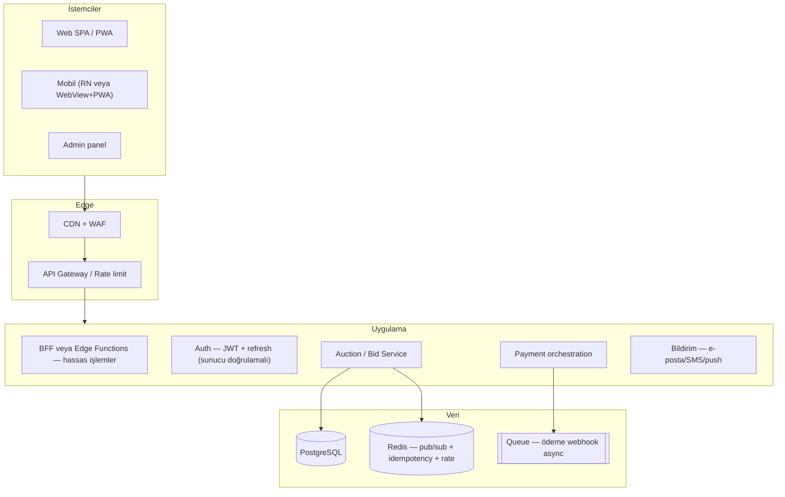

# İhaleal.com — Production Platform Master Plan

**Belge:** CTO / sistem mimarisi + hukuki çerçeve özet · **avukatlık hizmeti değildir**  
**Üretim kodu gerçeği:** `src/lib/fees.ts`, `docs/ARCHITECTURE.md`, `docs/hukuk/IHALEAL_TAM_HUKUK_VE_IS_PLANI.md`  
**Son güncelleme:** 2026-04-29

---

## 1. Hukuki mimari (Türkiye)

### 1.1 Yasal uygunluk (özet)

| Konu | Değerlendirme |
|------|----------------|
| Online gayrimenkul için süreli teklif + en yüksek teklif | Tek başına “yasadışı” değil; **iş akışı, sıfat, ödeme modeli ve beyanlar** risk üretir. |
| Taşınmaz ticareti yetki belgesi | Şirket faaliyet konusu + TKHK çerçevesinde **somut olayda** zorunluluk değerlendirmesi (detay: `docs/hukuk/`). |
| “İhale” kelimesi | Kamu İhale Kanunu çağrışımını tetikleyebilir; ürün dilinde **“açık artırma / müzayede süreci / süreli teklif turu”** tercih edilir. |
| Platform sıfatı | **Aracılık + yazılım hizmeti** (bilgilendirme); tapu sonucuna doğrudan garanti verilmez (sözleşme + ürün tutarlılığı). |

### 1.2 Risk listesi (yüksek öncelik)

| # | Risk | Sonuç |
|---|------|--------|
| R1 | Ödemelerin platform işleteninin serbest hesabında birikmesi | ÖHS/BDDK çerçevesi + fon takibi gerekliliği |
| R2 | TKHK “emlak alım satımına aracılık” sıfatının yanlış veya eksif tanımı | Yetki belgesi / organizasyon uyumsuzluğu |
| R3 | KVKK + ön bilgilendirme eksikliği | İdari para cezası + güven kaybı |
| R4 | Teklif manipülasyonu / iç çember teklifleri | Ticari ve ceza hukuku + itibar |
| R5 | Mesafeli satış / cayma rejimi ile çakışan UX | Yanlış statü seçimi → iade ihtilafı |

### 1.3 Risk çözüm mimarisi (sistem + süreç)

```
[Hukuk] Avukat onaylı sözleşmeler + şeffaf şartname + rol tanımı (satıcı/alıcı/platform)
        ↓
[Ürün] "Sonuç garantisi yok" dilinin UI/API ile tutarlılığı; rezerv fiyat; log/Zaman damgası
        ↓
[Ödeme] Müşteri parasının işleten hesabında tutulmaması (bloke/ÖHS/banka üçgeni — modele göre)
        ↓
[Teknik] Sunucu saati; immutable audit; RLS; kritik işlemlerde Edge/BFF doğrulaması
```

### 1.4 Güvenli terminoloji

| Kaçınılacak / dikkat | Önerilen |
|---------------------|----------|
| Devlet ihalesi çağrışımı (“ihale kapandı” tek başına) | “Teklif turu sona erdi”, “müzayede süreci”, “açık artırma oturumu” |
| Kesin tapu taahhüdü | “Kazanan teklif → sözleşme/tescil adımları ayrı” |
| Havuz / escrow iddiası (mevzuata uygun değilse) | “Ödeme yönlendirmesi”, “bloke süreç”, “ÖHS koşulları” |

**Bağlayıcı hukuki metin:** Depo `docs/hukuk/` — imza öncesi Türkiye Barosu avukatı.

---

## 2. Sistem mimarisi (full)

### 2.1 Katmanlar



### 2.2 Evrim stratejisi (ölçeklenebilirlik)

| Faz | Mimari | Not |
|-----|--------|-----|
| **MVP** | Modüler monolith (NestJS veya Supabase + Edge Functions) + Postgres + tek Realtime kanalı | Hızlı doğrulama; \<5k eşzamanlı teklif odağı |
| **Scale** | Bid path için **ayrı süreç + Redis leader election / sequential pipeline**; okuma replikaları | 10k+ eşzamanlı için şart |
| **Enterprise** | Teklif yazma path’ini mikroservis + event sourcing (opsiyonel) | İzlenebilirlik ve denetim |

**Öneri:** Başlangıçta **modüler monolith** (Net Alt Domain: auction, payment, listing, identity); servis sınırları net module boundaries ile çizilir — sonradan extract kolay.

### 2.3 Frontend (web + mobil)

| Bileşen | Teknoloji |
|---------|-----------|
| Web | **React** + TypeScript (mevcut: **Vite**); üretim için **Next.js (SSR/ISR)** isteğe bağlı SEO ve güvenlik başlıkları |
| State | TanStack Query + sunucu gerçeği (tek kaynak: API + Realtime) |
| Mobil | **React Native** veya **Capacitor** ile PWA sarımı — tek API sözleşmesi |
| Admin | Rol tabanlı (RBAC); ayrı bundle veya subdomain |

### 2.4 Backend seçimi

| Seçenek | Artı | Eksi |
|---------|------|------|
| **Node.js + NestJS** | TS ekosistemi, DI, modüller, WebSocket birinci sınıf | Ekip JVM değilse JVM alternatifi yok |
| **Django + DRF** | Admin, ORM, güvenlik defaults | Real-time için Channels ek yük |

**Öneri:** **NestJS + PostgreSQL + Redis** — repo TypeScript ile uyumlu; WebSocket/gateway tek codebase.

### 2.5 Veritabanı (mantıksal)

- **PostgreSQL:** ilişkisel gerçeklik (ACID teklif yazımı).
- **Redis:** gerçek zamanlı yayın kanalı; kısa TTL lock; rate limit sayaçları.
- **Queue (SQS / BullMQ):** ödeme webhook, bildirim, raporlama.

---

## 3. Açık artırma çekirdeği (core engine)

### 3.1 Kurallar (repodaki sabitlerle hizalı)

`src/lib/fees.ts`: `MIN_INCREMENT_TRY`, `ANTI_SNIPING_THRESHOLD_SECONDS` (varsayılan **120**), `ANTI_SNIPING_EXTEND_SECONDS` (**120**). Üretimde **10 saniye** uzatma talep edilirse `fees.ts` ve şartname birlikte güncellenir — düşük süre **yoğun sniping + sunucu gecikmesi** nedeniyle tartışma çıkarır.

### 3.2 Tek doğruluk

- **Teklif süresi ve sıra:** yalnızca **sunucu zamanı** (`auction_server_now()` veya DB `statement_timestamp()`).
- **Yazma path:** tek transaction; `SELECT … FOR UPDATE` veya sıralı kuyruk işçisi (Redis Stream tek consumer).

### 3.3 Anti-sniping algoritması (pseudo)

```
INPUT: auction_id, bid_amount, user_id, client_ts
SERVER_NOW = now_utc_from_db()

IF auction.status != 'live' THEN REJECT('closed')
IF bid_amount < current_high + MIN_INCREMENT THEN REJECT('increment')

IF SERVER_NOW > auction.ends_at THEN REJECT('closed')

-- Anti-sniping window
IF SERVER_NOW >= auction.ends_at - THRESHOLD_SECONDS THEN
    new_ends_at = auction.ends_at + EXTEND_SECONDS
    IF new_ends_at > auction.max_extension_cap THEN  -- opsiyonel üst sınır
        new_ends_at = min(new_ends_at, auction.max_extension_cap)
    auction.ends_at = new_ends_at
END IF

INSERT bid (...) RETURNING id
UPDATE auction SET current_high = bid_amount, leading_user_id = user_id, ...

COMMIT
PUBLISH realtime_channel(auction_id, event='bid_accepted')
```

### 3.4 Sahte teklif / dolandırıcılık önleme (skorlamalı)

| Kontrol | Uygulama |
|---------|----------|
| Kimlik | KYC seviyesi (telefon → kimlik → IBAN eşlemesi) |
| Ödeme yetkisi | Teminat veya kart ön auth (ÖHS üzerinden) |
| Davranış | Aynı cihazdan çok hesap → risk skoru |
| Teklif | Anormal sıçrama / self-outbid → inceleme kuyruğu |
| Ağ | Velocity limit IP + ASN + device fingerprint (privacy uyumlu) |

### 3.5 En yüksek teklif doğrulama

- Kaynak: `auctions.current_high`, `bids` tablosu immutable insert + index `(auction_id, created_at DESC)`.
- Periyodik reconcilation job: `MAX(amount)` ile tutarlılık kontrolü.

### 3.6 Transaction locking

- **Option A:** Postgres row lock `FOR UPDATE` on `auctions` row (basit; contention’da sıralı latency).
- **Option B:** Redis `INCR` ile global auction shard + ordered bid processor (yüksek ölçek).
- **Idempotency:** `Idempotency-Key` header ile tekrar gönderimde çift yazım yok.

---

## 4. Para akışı sistemi

### 4.1 Komisyon modeli (kod gerçeği)

| Kalem | Oran / tutar |
|-------|----------------|
| Satıcı işlem komisyonu (matrah) | **%4** + KDV (`VAT_RATE` = 0.20) |
| Alıcı işlem komisyonu | **0** |
| Ortak emlakçı B2B | **%2** + KDV; ödeme hedefi **7 gün** |
| Üyelik | Satıcı **5.000 TL/yıl**, alıcı **1.000 TL/yıl** |
| Hizmet kalemleri | `SERVICE_FEES` |

### 4.2 Üç ödeme mimarisi (özet)

| Model | Akış | Platform riski |
|-------|------|----------------|
| **A — Yönlendirme** | Ödeme doğrudan satıcı/hukuk bürosu; platform fatura keser | Düşük havuz riski |
| **B — Bloke / escrow benzeri** | Banka veya yetkili ÖHS bloke hesabı | Orta — sözleşme ve bilgilendirme kritik |
| **C — Hak ediş paylaşımı** | ÖHS split / marketplace settlement | Entegrasyon karmaşıklığı; düşük nem |

**En güvenli genel ilke:** Müşteri parasının platformun **serbest nakit** hesabında tutulmaması; tahsilat **yetkili kuruluş** çerçevesinde.

### 4.3 Stripe vs iyzico benzeri

- **Türkiye kart yerel tahsilat:** ÖHS / yerel ödeme kuruluşu (iyzico, PayTR vb.) — **PCI**: kart PAN tarayıcıda işlenmez; Checkout redirect veya tokenization.
- **Stripe:** çoğunlukla yurt dışı entity ve döviz; Türkiye yerel model ile karıştırılmamalı — ürün ve hukuk ayrı analiz.

### 4.4 BDDK / TCMB hatırlatıcısı

- Ödeme hizmeti sunumu **6493 ve ikincil düzenlemelere** tabi olabilir; “havuz” ve saklama tasarımı **mutlaka** hukuk + ödeme kuruluşu ile netleşir.

### 4.5 Teminat (`BID_BOND_RATE = 0.05` — üretim politikası)

- Tahsilat ÖHS üzerinden bloke veya ön provizyon.
- İade kuralları şartnamede (kazan kaybet / cayma).

---

## 5. Güvenlik mimarisi

| Alan | Uygulama |
|------|----------|
| Fraud | Risk engine (kurallar + ML ikinci aşama); manuel review queue |
| Bot | CAPTCHA adımı ani aktivitede; TLS fingerprinting dikkatli kullanım |
| IP / device | Hash’lenmiş device id + IP velocity; KVKK için amaç sınırlaması |
| Rate limiting | API GW + Redis sliding window; endpoint bazlı (`POST /bids` sıkı) |
| Audit log | `audit_logs` append-only; kim, ne, zaman, önce/sonra hash zinciri (opsiyonel) |
| Oturum | JWT kısa ömür + refresh rotation; kritik işlem step-up (MFA) |

---

## 6. Veritabanı tasarımı (tam şema özeti)

### 6.1 ER özeti

```
users 1—1 profiles
users 1—* listings_seller
properties 1—1 listings (veya listing içinde snapshot)
listings 1—1 auctions
auctions 1—* bids
users 1—* bids
auctions 1—* payments
contracts (listing_id / auction_id) — hukuki PDF hash
disputes — auction veya contract FK
```

### 6.2 Tablolar

#### `users` (veya `auth.users` + `profiles`)

| Alan | Tip | Not |
|------|-----|-----|
| id | uuid PK | auth ile uyumlu |
| email | citext unique | |
| phone | text | E.164 |
| role | enum | buyer, seller, admin, realtor |
| kyc_level | smallint | 0–3 |
| risk_score | numeric | |
| created_at | timestamptz | |

**Index:** `(email)`, `(phone)` where not null.

#### `properties`

| Alan | Tip |
|------|-----|
| id | uuid PK |
| owner_user_id | uuid FK → users |
| title_deed_ref | text nullable |
| city, district | text |
| parcel_snapshot | jsonb |
| created_at | timestamptz |

#### `listings`

| Alan | Tip |
|------|-----|
| id | uuid PK |
| property_id | uuid FK |
| seller_user_id | uuid FK |
| status | enum draft, pending_review, live, sold, cancelled |
| featured_until | timestamptz nullable |
| moderation_notes | text |

**Index:** `(status, created_at DESC)`, `(seller_user_id)`.

#### `auctions`

| Alan | Tip |
|------|-----|
| id | uuid PK |
| listing_id | uuid FK unique |
| starts_at, ends_at | timestamptz |
| reserve_price | numeric nullable |
| min_increment | numeric |
| status | enum scheduled, live, ended, cancelled |
| current_high | numeric |
| leading_user_id | uuid nullable |
| extend_count | int default 0 |
| server_clock_anchor | timestamptz | drift izleme |

**Index:** `(status, ends_at)`, `(listing_id)`.

#### `bids`

| Alan | Tip |
|------|-----|
| id | bigserial PK |
| auction_id | uuid FK |
| user_id | uuid FK |
| amount | numeric |
| idempotency_key | text unique nullable |
| ip_inet | inet nullable |
| device_fp_hash | text nullable |
| created_at | timestamptz default now() |

**Index:** `(auction_id, amount DESC, created_at DESC)`, `(auction_id, created_at)`.

#### `payments`

| Alan | Tip |
|------|-----|
| id | uuid PK |
| user_id | uuid FK |
| auction_id | uuid FK nullable |
| provider | text |
| provider_ref | text |
| amount | numeric |
| currency | char(3) |
| purpose | enum membership, bond, commission, service |
| status | enum pending, succeeded, failed, refunded |
| metadata | jsonb |

**Index:** `(provider, provider_ref)` unique, `(user_id, created_at DESC)`.

#### `contracts`

| Alan | Tip |
|------|-----|
| id | uuid PK |
| auction_id | uuid FK |
| parties | jsonb |
| doc_hash_sha256 | text |
| signed_at | timestamptz nullable |

#### `disputes`

| Alan | Tip |
|------|-----|
| id | uuid PK |
| auction_id | uuid FK |
| opened_by | uuid FK |
| reason_code | text |
| status | enum open, investigating, resolved |
| resolution | text nullable |

#### `audit_logs`

| Alan | Tip |
|------|-----|
| id | bigserial PK |
| actor_id | uuid nullable |
| action | text |
| entity | text |
| entity_id | uuid |
| payload | jsonb |
| created_at | timestamptz |

**Index:** `(entity, entity_id, created_at DESC)`.

### 6.3 Row Level Security (Supabase kullanımında)

- `bids`: insert kendi `user_id` ile; select kendi + satıcı moderasyon (policy ile).
- `auctions`: public read limited alanlar; sensitive admin only.

---

## 7. Backend (code level)

### 7.1 Önerilen stack

**NestJS** + **TypeORM/Prisma** + **@nestjs/websockets** + **ioredis**.

### 7.2 API endpoint listesi (çekirdek)

| Method | Path | Açıklama |
|--------|------|----------|
| POST | `/auth/register` | Kayıt |
| POST | `/auth/login` | Access + refresh |
| POST | `/auth/refresh` | Refresh rotation |
| GET | `/listings` | Filtreli liste |
| POST | `/listings` | Satıcı oluşturur |
| GET | `/listings/:id` | Detay |
| POST | `/auctions/:id/bids` | Teklif (idempotency) |
| GET | `/auctions/:id/stream` | SSE veya WebSocket upgrade |
| POST | `/payments/intent` | ÖHS ön oturum |
| POST | `/webhooks/payment` | İmzalı webhook |
| GET | `/admin/queue/moderation` | Admin |

### 7.3 Auth örneği (NestJS — kavramsal)

```typescript
// jwt.strategy.ts — özet
@Injectable()
export class JwtStrategy extends PassportStrategy(Strategy, 'jwt') {
  constructor(private users: UsersService) {
    super({ jwtFromRequest: ExtractJwt.fromAuthHeaderAsBearerToken(), ignoreExpiration: false, secretOrKey: process.env.JWT_SECRET });
  }
  async validate(payload: { sub: string }) {
    return this.users.findById(payload.sub);
  }
}
```

### 7.4 Bid service (transaction — kavramsal)

```typescript
async placeBid(dto: PlaceBidDto, userId: string) {
  return this.dataSource.transaction(async (manager) => {
    const auction = await manager
      .createQueryBuilder(Auction, 'a')
      .setLock('pessimistic_write')
      .where('a.id = :id', { id: dto.auctionId })
      .getOne();
    if (!auction || auction.status !== 'live') throw new BadRequestException('closed');
    const now = await manager.query(`SELECT statement_timestamp()`);
    if (now > auction.endsAt) throw new BadRequestException('closed');
    if (dto.amount < auction.currentHigh + auction.minIncrement) throw new BadRequestException('low');

    let endsAt = auction.endsAt;
    const thresholdMs = ANTI_SNIPING_THRESHOLD_SECONDS * 1000;
    if (auction.endsAt.getTime() - now.getTime() <= thresholdMs) {
      endsAt = new Date(auction.endsAt.getTime() + ANTI_SNIPING_EXTEND_SECONDS * 1000);
    }

    await manager.insert(Bid, { auctionId: auction.id, userId, amount: dto.amount });
    await manager.update(Auction, { id: auction.id }, { currentHigh: dto.amount, leadingUserId: userId, endsAt, extendCount: () => '"extendCount" + 1' });

    return { accepted: true, endsAt };
  });
}
```

### 7.5 Payment orchestration

- ÖHS SDK ile `createCheckoutForm` veya intent.
- Webhook: **imza doğrula** → idempotent insert `payments` → state machine.

---

## 8. Frontend mimarisi

| Sayfa | Rol | Önemli bileşenler |
|-------|-----|-------------------|
| Listing | Herkes | Galeri, konum, hukuki uyarılar |
| Auction live | Giriş yapmış teklifçi | Gerçek zamanlı fiyat, kalan süre, throttle debounce |
| Satıcı paneli | Satıcı | İlan, evrak, komisyon önizlemesi (`fees.ts`) |
| Alıcı paneli | Alıcı | Üyelik, teminat durumu |
| Admin | Admin | Moderasyon, şüpheli teklifler, kullanıcı risk |

**Tek stack önerisi:** React + TypeScript; SEO kritikse Next.js App Router.

---

## 9. DevOps ve ölçekleme

| Konu | Öneri |
|------|--------|
| Konteyner | **Dockerfile** multi-stage (build → distroless/nginx) |
| CI/CD | GitHub Actions: `lint → test → build → scan → deploy` |
| Cloud | **AWS** (ECS/EKS + RDS + ElastiCache) veya **GCP** (Cloud Run + Memorystore) |
| Auto scaling | Web/API: CPU + request count; Redis cluster; DB connection pooling (PgBouncer) |
| Redis | Teklif yayını pub/sub; rate limit; kısa ömür cache listeler |

---

## 10. Gelir modeli (ürün)

| Kaynak | Detay |
|--------|--------|
| İşlem komisyonu | Satıcı %4 + KDV (`fees.ts`) |
| B2B ortak pay | %2 + KDV |
| Üyelik | Yıllık sabit |
| Premium / featured | `featured_until`, sıralama boost — faturalama ayrı ürün kalemi |
| Abonelik | Üyelik ile birleşik veya tier |

---

## 11. MVP planı (0 → 1)

| Hafta | Çıktı |
|-------|--------|
| **1** | Auth, profil, ilan oluşturma (taslak), admin moderasyon, hukuki metin placeholder → avukat turu |
| **2** | Auction entity + bid API + Postgres lock path + temel Realtime + `fees.ts` UI |
| **3** | Ödeme sandbox (üyelik + teminat akışı demo), audit log, rate limit |
| **Launch** | Sınırlı şehir/bayi pilotu, feature flag, observability (Sentry + metrics), yük testi (k6) |

---

## 12. Sonuç — doğrudan cevaplar

| Soru | Cevap |
|------|--------|
| Production’a hazır mı? | **Hayır — tek başına doküman/codebase “hazır” değildir.** Hazır olmak için: hukuki kilitleme, ödeme kuruluşu anlaşması, yük/güvenlik testleri, DR planı. |
| En büyük 5 risk | (1) Ödeme/havuz uyumsuzluğu (2) TKHK sıfat (3) Fraud/teklif manipülasyonu (4) Ölçekte DB lock contention (5) KVKK/ön bilgilendirme |
| Daha güvenli yapmak | BFF doğrulama, MFA, audit, ÖHS ile blokeli model, düzenli hukuk revizyonu, penetrasyon testi |
| Yatırımcı için hazır mı? | **Story + traction + düzenleyici netlik** olmadan hayır; DD için hukuk mütalası ve ödeme partner LOI güçlü sinyal |

---

## Ek: Repo ile senkron

- Mimari özet: `docs/ARCHITECTURE.md`
- Güvenlik sınırları: `docs/SECURITY_MODEL.md`
- Gelir: `docs/REVENUE_MODEL.md`
- Hukuk birleşik plan: `docs/hukuk/IHALEAL_TAM_HUKUK_VE_IS_PLANI.md`

Bu dosya üretim kararlarının **tek mühendislik omurgasıdır**; hukuki paragraflar için depodaki hukuk klasörü ve avukat güncellemesi esastır.
